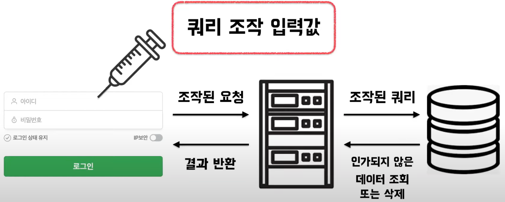

# 프론트엔드 웹 보안

# SQL Injection

SQL 삽입. SQL 주입이라고도 하며 코드 인젝션의 기법 중 하나로 클라이언트의 입력값 조작을 통해 서버의 Database를 공격하는 방식이다.<br/><br/>

## SQL Injection 시나리오



```sql
select * from member
where id = '" + id + "' and "password = '" + password + "';"
```

로그인에 대한 쿼리문이 위와 같을 때 공격자가 SQL Injection을 하기 위해 id에 frontStudy’ or 1 = 1 #’ password에는 1234를 넣게 되면?

```sql
select * from member
where id = 'frontStudy' or 1 = 1 # + "' and " password = '1234';"
```

이러한 쿼리문이 된다. password 부분은 주석처리가 된다.

```sql
select * from member
where id = 'frontStudy' or 1 = 1 #
```

최종적으로, `or 1 = 1` 때문에 항상 True를 갖게 되어 로그인을 성공하게 된다.<br/><br/>

## Error Based SQL Injection


Database에 고의적으로 오류를 발생 시켜 에러 출력을 통해 Database 구조를 파악하고 필요한 정보를 습득한다.<br/><br/>

## Union Based SQL Injection

Database의 UNION 연산자를 사용하여 쿼리 결과값의 조합을 통해 정보를 파악한다. 전제 조건은 컬럼의 개수와 데이터 형식이 같아야한다.


<br/><br/>

### Union Based SQL Injection 시나리오


😈공격자: 컬럼이 몇개인지 하나씩 넣어보면서 알아봐야지~

😈공격자 : 컬럼이 7개이구나! 추가로 공격해야지~


😈공격자: version()을 통해서 버전도 알아봐야지~

😈공격자: information_schema.tables로 무슨 테이블이 있는지 알아봐야겠다~
<br/><br/>

## SQL Injection 대응 방안

- **에러 메세지 노출 차단**하여 공격자가 에러 메세지로 정보를 알 수 없도록 한다.
- **입력값 검증**을 통해 사용 가능한 특수 문자를 제한하거나 `\n, \t, |, #, --, &`와 같은 특수 문자 필터링을 한다.

```sql
input = input.replace("--", "");
input = input.replace("(", "");
input = input.replace(")", "");
input = input.replace(",", "");
```

<br/><br/>

# XSS(Cross Site Scripting)

악성 스크립트를 웹 사이트에 주입하는 코드 인젝션의 기법 중 하나로 공격자가 웹 어플리케이션에 보낸 악성 코드가 다른 사용자에게 전달될 때 발생한다.

1. 공격자가 서버에 악성 스크립트를 저장한다
2. 사용자가 Request을 보낸다
3. 사용자는 Response + 악성스크립트를 받는다
   <br/><br/>

## Stored XSS(저장형 XSS)

공격자가 웹 애플리케이션에 악성 스크립트를 영구적으로 저장하는 경우 발생한다.

일반적으로 댓글, 게시글, 사용자 프로필과 같은 사용자가 입력한 데이터를 저장하는 기능에서 발생한다.
<br/><br/>

### Stored XSS 시나리오

`<script> alert(document.cookie); </script>`


1. 블로그 작성 글에 스크립트문을 넣는다.
2. 글은 정상적으로 작성되지만 이 것을 조회한 사용자는 사용자의 쿠키값이 작성된 팝업창을 볼 수 있다.<br/><br/>

## Reflected XSS(반사형 XSS)

사용자의 요청에 즉시 반응하여 악성 스크립트를 실행하는 경우 발생한다.

공격자는 악성 스크립트를 포함한 URL을 희생자에게 보내고, 희생자가 이를 클릭하면 웹 애플리케이션은 이 스크립트를 즉시 실행한다.


1. 공격자가 스크립트가 담긴 url을 주소 변환을 통해 숨긴다.
2. 사용자를 속일 수 있는 메일에 담아서 보낸다.
3. 사용자는 url을 클릭하게 되고 스크립트가 실행된다.
   <br/><br/>

## Dom Based XSS

서비스의 스크립트를 이용하여 DOM에 악의적인 스크립트가 노출되도록 공격하는 방법이다. Relected XSS와 유사해보이지만 서버를 타지 않고 DOM을 조작할 수 있기 때문에 문제를 찾기 힘들다.


<br/><br/>

## XSS 대응방안

- 입/출력 값 검증 및 필터를 통해 예방한다.
- 콘텐츠 보안 정책을 사용하여 스크립트 실행을 제한한다.
  <br/><br/>

### 왜 우리가 작성한 코드에서는 XSS가 발생하지 않았을까?

리액트는 모든 값을 렌더링하기 전에 이스케이프(치환) 하므로, 애플리케이션에서 명시적으로 작성되지 않은 내용은 주입되지 않는다. 모든 항목은 렌더링 되기 전에 문자열로 변환된다. 이런 특성으로 인해 XSS(cross-site-scripting) 공격을 방지할 수 있다.

```
& becomes &amp;
< becomes &lt;
> becomes &gt
" becomes &quot;
' becomes &#39;
```

<br/><br/>

# CSRF (Cross-Site Request Forgery)

사용자가 자신의 의지와는 무관하게 공격자가 의도한 행위(수정, 삭제, 등록 등)를 특정 웹사이트에 요청하게 만드는 공격이다.

CSRF 공격이 이루어지려면 다음 조건이 만족되어야 한다.

- 위조 요청을 전송하는 서비스(페이스북)에 희생자가 로그인 상태
- 희생자가 해커가 만든 피싱 사이트에 접속
  <br/><br/>

## CSRF 시나리오


페이스북에 글을 쓸 때 아래 코드와 같은 형식으로 전송된다고 예를 들자.

```html
<form action="http://facebook.com/api/content" method="post">
  <input type="hidden" name="body" value="여기 가입하면 돈 10만원 드립니다." />
  <input type="submit" value="Click Me" />
</form>
```

1. 피싱 사이트에 똑같이 페이스북에 글쓰기를 요청하는 폼이 숨겨져 있고, 그 내용으로 가입하면 10만원을 준다는 사기성 광고를 본문으로 적혀져 있다.
2. 사용자는 피싱 사이트에 접속한다. 페이스북에 로그인되어 있는 상태기 때문에 요청이 성공한다.
3. 사용자 본인의 페이스북 계정으로 해당 글이 등록되게 된다.
4. 위의 공격을 통해 사용자의 페친들은 친구가 올린 글이니 의심없이 속아 넘어간다.
   <br/><br/>

## CSRF 대응 방안

- **Referer Check:** Back-end 단에서 request의 referrer를 확인하여 domain (ex. \*.facebook.com) 이 일치하는 지 검증하는 방법이다.
- **CSRF Token:** 모든 요청에 토큰을 발급하여 서버에서 검증하는 방어 방법이다. 발급된 토큰을 서버로 전달하지 않으면 요청이 허락되지 않는다.
  <br/><br/>

# JavaScript Injection

**브라우저에서 자바스크립트를 삽입시키는 공격**이다. 브라우저에서 제공하는 Console을 통해 조작 가능하다. 만약 Client-Side에 민감한 데이터를 넣어놨다면 해당 공격을 통해 탈취가 가능하다.


<br/><br/>

## JavaScript Injection 대응방안

클라이언트엔 민감한 데이터를 절대 Plain하게 넣지 않는다. 또한, 데이터 유효성 검사가 필요한 경우 서버에서 처리하도록 한다.
<br/><br/>

# 참고

[https://www.youtube.com/watch?v=laQAQeuuJF4](https://www.youtube.com/watch?v=laQAQeuuJF4)

[https://kciter.so/posts/basic-web-hacking](https://kciter.so/posts/basic-web-hacking)

[https://itstory.tk/entry/CSRF-공격이란-그리고-CSRF-방어-방법](https://itstory.tk/entry/CSRF-%EA%B3%B5%EA%B2%A9%EC%9D%B4%EB%9E%80-%EA%B7%B8%EB%A6%AC%EA%B3%A0-CSRF-%EB%B0%A9%EC%96%B4-%EB%B0%A9%EB%B2%95)
