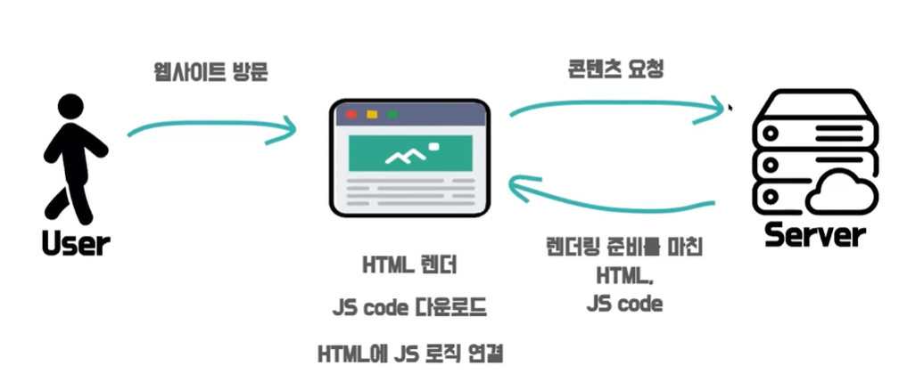

# SPA와 MPA

## SPA(Single Page Application)란?

하나의 페이지로 구성된 웹 어플리케이션이다.

AJAX가 등장한 이후로 원하는 부분만 클라이언트에서 동적으로 갈아끼울 수 있고 화면 깜빡임이 없는 SPA를 사용하게 되었다.

## MPA(Multi Page Application)란?

탭을 이동할 때마다 서버로부터 새로운 html을 받아와서 페이지 전체를 새로 렌더링하는 전통적인 웹 페이지 구성 방식이다.

단점: 매번 새로운 HTML을 서버로부터 받아오며 전환 시마다 화면이 깜빡인다.
  

# CSR과 SSR

일반적으로 SPA에서는 렌더링 방식으로 CSR을 MPA에서는 렌더링 방식으로 SSR을 차용한다. SPA는 웹 어플리케이션에 필요한 정적 리소스를 초반 한번에 모두 다운로드 하고 그 이후에 새로운 페이지 요청이 있을 때 페이지 갱신에 필요한 데이터만 전달받아서 클라이언트에서 페이지를 전달받아서 클라이언트에서 페이지를 갱신하기 때문에 자연스럽게 렌더링 방식으로 CSR을 사용하게 되고 MPA는 새로운 요청이 있을 때마다 서버에서 이미 렌더링 된 정적 리소스를 받아오기 때문에 렌더링 방식으로 SSR을 사용하게 된다.

## CSR(Client Side Rendering)

**클라이언트 측에서 렌더링**을 하는 방식이다.  

### CSR의 동작 과정

1. 유저가 웹사이트에 방문한다
2. 브라우저가 서버의 콘텐츠를 요청한다.
3. 서버는 **빈 뼈대만 있는 HTML과 연결된 JS 링크를 응답으로 보내준다.**
4. 브라우저가 연결된 JS링크를 통해 서버로부터 다시 **JS파일을 다운로드 받고 동적으로 페이지를 만들어서 브라우저에 띄운다**.  

### CSR의 특징

**빈 뼈대만 있는 HTML과 연결된 JS 링크를 응답으로 보내준다.
⇒ 빈 뼈대만 보내기 떄문에 서버측 부하가 적고 클라이언트 측에서 연산, 라우팅 등을 직접 처리하기 때문에 반응 속도가 빠르고 UX도 우수하다.** 브라우저들이 가진 웹 크롤러는 HTML을 읽어서 검색 가능한 색인을 만들어내는데 웹 크롤러 봇입장에서 본 HTML은 빈 뼈대만 있기 때문에 텅텅 비어있다. 검색 엔진이 색인을 할만한 컨텐츠가 존재하지 않기 때문에 SEO(검색 엔진 최적화)에 불리하다는 치명적인 단점이 있다. (참고: 최근 검색 엔진들은 JS를 해석할 수 있기도 하지만 모든 검색 엔진이 최적화를 지원하지 않기 때문에 고려하는 것이 좋다.)

브라우저가 **JS파일을 다운로드 받고 동적으로 페이지를 만들어서 브라우저에 띄운다**.
⇒ 초기 로딩 속도가 느리지만 초기 로딩 이후에 페이지의 일부를 변경할 때는 서버에 해당 데이터만 요청하면 되기 때문에 **이후 구동 속도는 빠르다**. JS가 동적으로 DOM을 생성하기 떄문에 HTML은 JS로직이 완전히 연결된 상태이다. **(TTV(Time To View) == TTI(Time To Interacte))**  

## SSR(Server Side Rendering)

**서버 측에서 렌더링**을 하는 방식으로 요청할 때 즉시 만들어서 응답하기 때문에 데이터가 자주 바뀌거나 미리 만들어두기 어려운 페이지에 적합하다.

### SSR의 동작 과정

1. 유저가 웹 사이트에 방문한다.
2. 브라우저에서 서버에 콘텐츠를 요청한다.
3. 서버에서는 즉시 페이지에 필요한 데이터를 얻어와 삽입하고, CSS까지 모두 적용해서 **렌더링 준비를 마친 HTML과 JS code를 브라우저의 응답으로 전달한다**.
4. **브라우저에서는 바로 전달받은 페이지를 띄우고** 이후 브라우저가 JS code를 다운로드 하고 HTML에 JS 로직을 연결한다.  

### SSR의 특징

**렌더링 준비를 마친 HTML과 JS code를 브라우저의 응답으로 전달한다.**
⇒ 모든 데이터가 이미 HTML에 담겨진 채로 브라우저에 전달되기 때문에 **검색엔진 최적화에 유리**하다. JS를 실행할 줄 모르는 크롤러 봇도 무리없이 HTML을 읽을 수 있기 때문이다.

**브라우저에서는 바로 전달받은 페이지를 띄운다.**
⇒ JS 코드를 다운받고 실행하기 전에 사용자가 화면을 볼 수 있다. JS 다운로드를 기다려야했던 CSR보다 **초기 구동 속도가 빠르다**. 하지만 인터렉션 가능한 페이지처럼 보이지만 그저 내용과 스타일이 입혀진 껍데기에 불과하고 실제로 클라이언트 측 JS가 실행되고 이벤트 핸들러가 첨부되서 **JS로직이 모두 연결되기 전까지 사용자의 입력에 응답할 수 없다. (TTV(Time To View) !== TTI(Time To Interacte))**  

## SSG(Static Site Generation), Static Rendering

서버에서 HTML을 보내준다는 측면에서는 SSR과 비슷하지만 언제 만들어졌느냐의 차이가 있다. 미리 다 만들어두기 때문에 바뀔 일이 거의 없는 페이지에 적합하다.  

## CSR과 SSR의 장점

| 분류 | CSR                             | SSR                        |
| ---- | ------------------------------- | -------------------------- |
| 장점 | 화면 깜빡임이 없음              | 초기 구동 속도가 빠름      |
|      | 초기 로딩 이후 구동 속도가 빠름 | SEO에 유리함               |
|      | TTV와 TTI 사이 간극이 없음      |
|      | 서버 부하가 클라이언트로 분산   |
| 단점 | 초기 로딩 속도가 느림           | TTV와 TTI 사이 간극이 있음 |
|      | SEO에 불리함                    | 화면 깜빡임이 있음         |
|      |                                 | 서버 부하가 있음           |

  

## CSR 단점 보완 방법

**초기 로딩 속도 보완**

- **code splitting, tree-shaking, chunk 분리**를 통해 JS 번들 크기를 줄여서 초기 DOM 생성 속도를 줄인다.
- **SSR, SSG 도입**

**SEO 개선**

- 라이브러리나 웹 팩 플러그인을 통해 각 페이지에 대한 HTML 파일을 미리 생성해둔 뒤 서버에서 요청하는 자가 클롤러라면 사전에 렌더링 된 HTML 버전 페이지를 보여주는 방식인 **pre-rendering**을 통해 개선한다.
- **SSR, SSG 도입**  

# CSR + SSR/SSG

CSR + SSR/SSG를 어떻게 만들까? 별도의 서버를 직접 운영한다! Next.js, Gatsby.js, NUXT.js, Angular Universal 등을 사용한다!

CSR에 SSR이나 SSG 도입을 편하게 만들어주는 것은 사실이지만 CSR에 비해 코드 복잡도가 올라가고 직접 제어할 수 없는 블랙박스 영역이 존재한다…ㅜㅜ 

## Hybrid Rendering: Isomorphic App. Universal Rendering

**서버와 클라이언트에서 동일한 코드가 동작하는 어플리케이션**이다. 서버에서 먼저 페이지를 렌더링하고, 그 후 클라이언트에서 추가적인 상호작용과 동적 업데이트를 처리한다. 클라이언트와 서버가 모두 같은 코드로 돌아가기 때문에 예상과는 다른 결과를 마주할 수도 있지만 **초기 로딩 속도와 SEO를 개선하면서도 CSR의 장점을 가질 수 있는 좋은 대안**이다.  

# CSR, SSR, SSG, Universal. 무엇을 선택해야할까?

**서비스의 성격에 따라 선택**한다.

- 사용자와의 상호작용이 많고 검색 엔진에 노출될 필요가 없다(개인 정보로 이루어진 페이지라던가..) ⇒ CSR
- 상위 노출이 되어야하고 누구에게나 동일한 내용을 노출하고 페이지 내용이 자주 바뀐다면 ⇒ SSR
- 상위 노출이 되어야하고 누구에게나 동일한 내용을 노출하고 페이지 내용을 업데이트 할 일이 거의 없다. ⇒ SSG
- 사용자에 따라 페이지 내용도 달라져야하고 빠른 인터렉션도 중요하고 검색 엔진 최적화도 포기할 수 없다. ⇒ CSR + SSR (Universal Rendering)
     

# 참고

[https://www.youtube.com/watch?v=YuqB8D6eCKE](https://www.youtube.com/watch?v=YuqB8D6eCKE)
