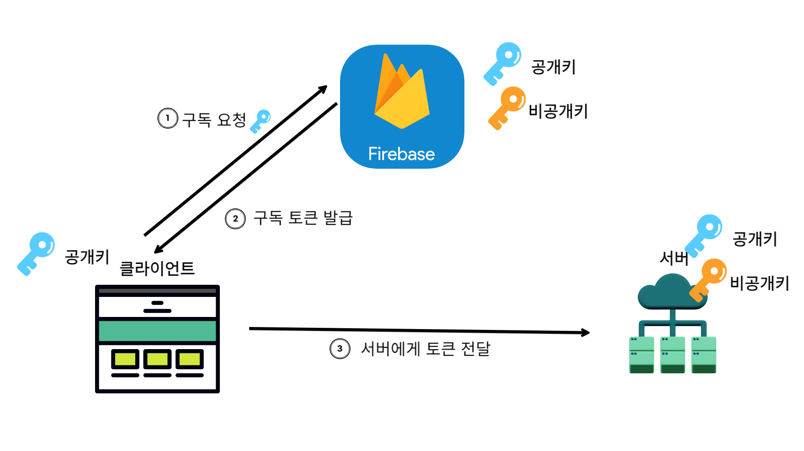
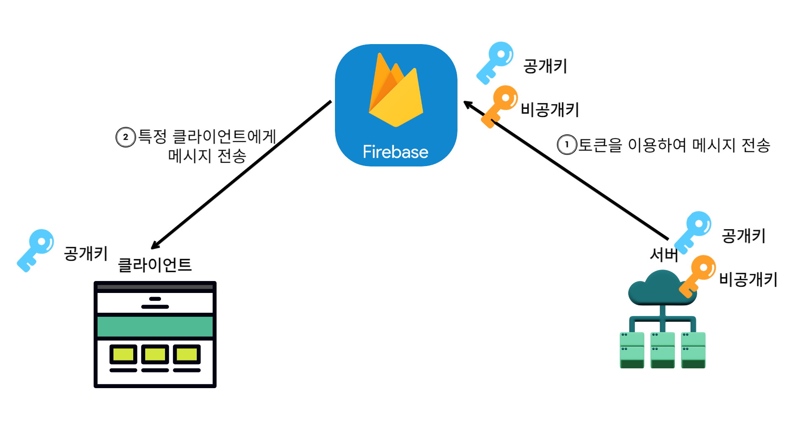

# PWA란? (progressive web app)

**웹과 네이티브 앱의 장점을 결합한 형태의 웹 애플리케이션**이다.

새롭게 떠오르는 **웹 브라우저 API**를 전통적인 **점진적 향상(progressive enhancement) 기법**과 함께 사용해서 **네이티브 앱에 필적**하는 사용자 경험을 제공하는 **크로스 플랫폼 웹 애플리케이션**을 말한다.   

## 점진적 향상이란? (progressive enhancement)

웹 개발 방법론 중 하나로, 기본적인 웹 기능을 모든 브라우저와 장치에 제공하면서, 고급 브라우저와 장치에 대해 향상된 기능을 제공하는 방식으로 웹을 구축하는 것에 중점을 두는 것을 말한다.

PWA는 기본적으로 모든 사용자에게 웹페이지의 핵심 콘텐츠를 제공하면서, 브라우저나 네트워크 환경이 허용하는 범위 내에서 추가 기능(예: 오프라인 접근, 푸시 알림 등)을 제공한다. 이렇게 점진적 향상 원칙을 따라 더욱 확장성 있고 사용자 친화적인 웹 애플리케이션이 될 수 있다.  

### 크로스 브라우징 지원

크로스 브라우징이란 **웹사이트가 다양한 웹브라우저에서 잘 동작하도록 하는 것**을 의미한다.

- **기능 탐지 및 폴리필**

  - 일부 오래된 웹 브라우저는 PWA의 기능을 완벽히 지원하지 않을 수 있다. 만약 이러한 브라우저에서 웹사이트가 로드되지 않는다면 사용자 경험에 큰 타격을 줄 수 있다. 이런 문제를 방지하기 위해 기능 탐지와 폴리필을 사용한다.
  - 기능 탐지는 웹 브라우저가 특정 기능을 지원하는지 확인하는 방법이다. 만약 지원하지 않는다면, 해당 기능을 사용하지 않거나 대체 수단을 제공한다.
  - 폴리필은 브라우저가 지원하지 않는 기능을 제공하는 코드를 말한다. 폴리필을 사용하면, 브라우저가 원래 지원하지 않는 기능도 사용할 수 있게 된다. 이를 통해 최신 기능을 이용하면서도 오래된 브라우저를 사용하는 사람들에게도 웹사이트를 제공할 수 있다.

     

# PWA 장단점

### 장점

- 서비스 워커(Service Worker)를 사용하여 오프라인이나 느린 네트워크에서도 작동
- 서비스 워커 업데이트 덕분에 항상 최신의 상태로 유지
- HTTPS를 통해 제공되므로 안전성 확보
- 다양한 플랫폼에서 실행 가능
- 네이티브 앱보다 훨씬 저렴하고 빠르게 개발
- 다양한 화면 크기 수용 - 훌륭한 반응형(데스크톱, 모바일, 태블릿 등 모든 폼 팩터에 맞음)
- 네이티브 앱과 비슷하기 때문에 사용하는데 어려움이 없음
- 참을성 있게 설치해야 할 인스톨 단계가 없음
- 검색 엔진에서 검색이 가능

### 단점

- 오래된 브라우저들은 PWA를 지원하지 않음
- iOS에서는 성능이 약하고 애플의 장치에 대한 지원이 적음
- 앱 스토어에서는 사용할 수 없으므로 마케팅 효과 떨어짐
- 배터리 전력 소모가 큼  

# PWA 요건

- HTTPS: 보안과 데이터 안정성 보장
- manifest.json: 브라우저에게 데스크톱이나 모바일 기기에 설치할 때 어떻게 작동해야 하는지 알려주는 JSON 형식의 파일
- serviceWorker.js: 서비스 워커는 사용자의 브라우저에 설치되어 백그라운드에서 동작하는, 별도의 스레드에서 실행되는 JavaScript 파일  

# 서비스 워커(Service Worker)

서비스워커는 웹 브라우저에서 백그라운드에서 실행되는 스크립트로 별도의 워커 스레드에서 동작하는 특징을 갖고있다.

페이지가 닫혔더라도 또는 네트워크가 끊어져도 서비스워커는 계속 동작한다.  

## 서비스워커 생명주기

1. **Installing**: 서비스워커가 처음으로 브라우저에 등록되면 설치 과정이 시작됩니다. 또한, 등록된 서비스워커에 업데이트가 발견되면 설치가 진행됩니다. 이 업데이트 여부는 기존 서비스워커 파일과의 바이트 단위 비교를 통해 확인됩니다.
2. **Installed/Waiting**: 설치가 완료된 서비스워커는 '대기' 상태로 전환됩니다. 하지만 기존 서비스워커가 아직 웹페이지를 제어하고 있다면 새로 설치된 서비스워커는 '대기' 상태를 유지하게 됩니다. 이 상태에서 서비스워커를 활성화하려면 기존 서비스워커가 제어하는 웹페이지를 모두 닫거나, 개발자 도구에서 **`skipWaiting`**을 호출하거나, **`install`** 이벤트 내에서 **`self.skipWaiting()`**을 호출해야 합니다.
3. **Activating**: 모든 웹페이지가 닫히면 '대기' 상태의 서비스워커는 '활성화' 상태로 전환됩니다. 그러나 이 상태에서도 페이지를 새로 고침하기 전까지는 웹페이지를 제어할 수 없습니다. 웹페이지의 제어권을 얻으려면, 페이지를 새로 고침하거나 **`activate`** 이벤트 내에서 **`self.clients.claim()`**을 호출해야 합니다.
4. **Activated**: 서비스워커가 '활성화' 상태가 되고 웹페이지를 제어하게 되면, 이제 **`fetch`**, **`sync`**, **`push`** 등의 이벤트를 제어할 수 있게 됩니다.
5. **Redundant**: 새로운 서비스워커에 의해 대체되면, 기존의 서비스워커는 '중복' 상태가 됩니다. 이 상태는 곧 제거될 서비스워커를 나타냅니다.  

# Web Push Notification

Web Push Notification는 서버가 특정 클라이언트(브라우저)에게 푸시 메시지를 보내고 이를 트리거하는 과정이다.  

# 웹 푸시 프로토콜

웹 기반 푸시 서비스에 메시지를 전송하기 위한 표준 프로토콜이다.  

## 웹 푸시 프로토콜 요소

1. Push API: 웹 어플리케이션에 푸시 메시지를 받는 기능을 제공
2. Service Worker: 웹 애플리케이션이 오프라인 상태이거나 백그라운드에 있을 때도 푸시 알림을 받을 수 있도록 돕는 웹 워커
3. Push Service: 사용자의 브라우저와 연결되어 있으며, 푸시 메시지를 부라우저로 전달하는 역할  

### 푸시 메시지 구독 과정(push Service직접 구현)

웹 푸시 관련해 초기 설정 시 공개키 암호화 방식을 사용해서 공개키와 비공개 키를 푸시서비스와 서버 각각에 등록을 한다.

1. 클라이언트는 서버로부터 공개키를 전달 받는다.
2. 클라이언트는 푸시서비스에게 공개키를 담아서 `pushManager.subscribe`를 이용하여 구독 요청을 보낸다.
3. 푸시서비스는 이에 대한 응답으로 구독 정보 객체인 `PushSubscription`을 보낸다.
4. 클라이언트는 이 구독 정보를 서버에 전달한다.  

### PushSubscription 객체 (구독 정보)

- endpoint: 푸시 서비스에 구독된 특정 서비스워커 인스턴스에 푸시 메세지를 전송하기 위해 사용되는 푸시서비스의 URL
- keys: 암호화 키 정보를 포함하는 객체  

### 푸시 메시지 전송 과정(push Service직접 구현)

1. 서버가 저장한 구독정보를 가지고 특정 브라우저에게 푸시 메시지를 비공개키로 암호화 후 푸시서비스로 전송한다.
2. 푸시서비스는 전달받은 푸시 메시지를 공개키로 검증 후 클라이언트로 메시지를 전송한다.  

## Push알림에서의 서비스워커

서비스워커로 푸시 메세지가 전달이 되면 서비스워커는 백그라운드에서 푸시 이벤트를 감지하고 `registration.showNotification` 메소드를 통해서 서비스워커가 알림을 표시하도록 user agent에 요청한다.  

## Push Service - FCM(Firebase Cloud Messaging)

푸시 메세지를 클라이언트(브라우저)로 전달하는 기능을 담당한다. 이 중 Firebase 클라우드 메시징(FCM) 메시지를 안정적으로 전송할 수 있는 크로스 플랫폼 메시징 솔루션이다.  

### 푸시 메시지 구독 과정(FCM)

클라이언트는 사용자에게 알림 권한을 요청하고, 이를 허용하지 않는 경우 이후의 과정을 중단한다. 이는 **`Notification.permission`**과 **`Notification.requestPermission()`**을 통해 확인하고 요청한다.

1. 사용자가 알림 권한을 허용하면, 클라이언트에 포함된 공개키를 담아서 FCM에게 `getToken`호출하여 구독 요청을 보낸다.
2. FCM은 요청을 처리하고 결과로 토큰을 발급하여 클라이언트에게 전달한다.
3. 클라이언트는 이 토큰을 서버에 전달한다.  

### 푸시 메시지 전송 과정(FCM)

1. 서버는 클라이언트에서 전달 받은 토큰을 이용하여 FCM에 메시지를 전송한다. (메시지는 서버에서 암호화 처리를 하지 않는다)
2. FCM은 토큰을 통해 식별한 특정 클라이언트에게 메시지를 전송한다.  

## FCM 장단점

### 장점

- 간단한 코드로 푸시 메시징 기능 구현
- FCM은 웹 뿐만 아니라 iOS, Android 등 다양한 플랫폼 지원 ⇒ 일관된 사용자 경험 제공
- 클라우드 기반으로 구축된 확장성

### 단점

- 커스터마이징 제한. ex) 암호화 키 관리, 메시지 포맷 등   

# 참고

[https://velog.io/@nezhitsya/기술면접-03](https://velog.io/@nezhitsya/%EA%B8%B0%EC%88%A0%EB%A9%B4%EC%A0%91-03)

[https://ha-young.github.io/2021/pwa/what_is_pwa/](https://ha-young.github.io/2021/pwa/what_is_pwa/)

[https://www.youtube.com/watch?v=x10CJNyKSLk&t=616s](https://www.youtube.com/watch?v=x10CJNyKSLk&t=616s)
