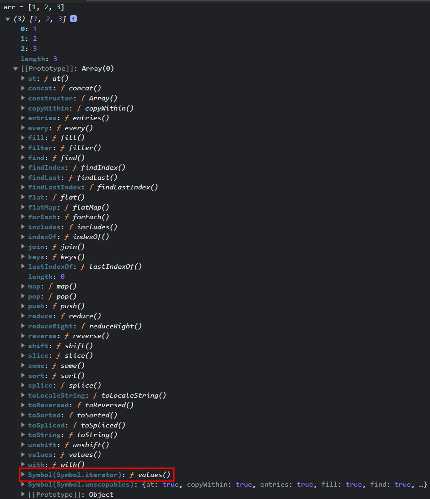
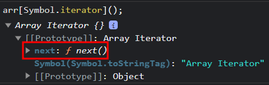
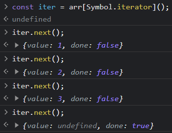

이터러블과 이터레이터를 본격적으로 설명하기 전에 친숙(?)해지기 위해 비유해보겠다.

과자 상자가 있다고 생각하자. 이 상자를 열면 과자를 하나씩 꺼낼 수 있다. 이 상자가 자바스크립트에서 이터러블과 비슷한 역할을 한다! 이터러블은 여러 개의 요소를 담고 있는데, 그 요소들을 하나씩 꺼낼 수 있다.

하지만 상자에 들어있는 과자를 꺼내려면 과자를 하나씩 꺼내는 도구가 필요하다. 이 도구를 자바스크립트에서는 이터레이터라고 한다. 이터레이터를 사용하면 상자(이터러블) 안에 있는 과자들을 순서대로 하나씩 꺼낼 수 있고, 상자 안에 얼마나 많은 과자가 남았는지 알려준다.

```javascript
let 과자들 = ['초코파이', '새우깡', '빼빼로'];

let 과자이터레이터 = 과자들[Symbol.iterator]();

console.log(과자이터레이터.next()); // {value: '초코파이', done: false}
console.log(과자이터레이터.next()); // {value: '새우깡', done: false}
console.log(과자이터레이터.next()); // {value: '빼빼로', done: false}
console.log(과자이터레이터.next()); // {value: undefined, done: true}
```

이제 이터러블과 이터레이터의 개념을 자세하게 살펴보겠다.
<br/><br/><br/>

# 이터러블(iterable)

이터러블은 반복 가능한 객체이다. `[Symbol.iterator]` 메소드를 키로 갖고 있어야 하며, 이 메소드는 이터레이터를 반환해야 한다.
대표적인 이터러블 객체로는 배열, 문자열, map, set 등이 있다.

<br/><br/><br/>

# 이터레이터(iterator)

이터레이터는 이터러블의 요소를 순회하는 포인터와 같은 역할을 한다.


이터레이터 객체는 반드시 `next`라는 메소드를 가지고 있어야하는데 `next` 메소드는 아래와 같은 객체를 반환한다.

- `value`: 현재 이터레이터가 가리키는 요소의 값
- `done`: 모든 요소를 순회했는지의 여부. 더 이상 순회할 요소가 없으면 `true`, 있으면 `false`

<br/><br/>

## 이터레이터와 `for...of` 루프

`for...of` 루프는 내부적으로 이터러블의 `[Symbol.iterator]()`를 호출하여 이터레이터를 가져와 순회하는 방식으로 동작한다. 이터러블이 정의한 순서대로 요소를 꺼내어 사용하기 때문에 우리가 구현한 이터러블의 순서대로 값을 얻을 수 있다.

```javascript
let arr = [10, 20, 30];
for (let value of arr) {
  console.log(value);
}
// 10, 20, 30
```

<br/><br/><br/>

# 이터러블 프로토콜 / 이터레이터 프로토콜

- 이터러블 프로토콜: 객체가 `for...of` 구문 등으로 순회될 수 있도록 약속된 규약이다. 이 규약을 준수하기 위해서는 해당 객체에 `[Symbol.iterator]`메서드가 있어야 한다. 이 메서드는 이터레이터를 반환한다.

- 이터레이터 프로토콜: 이터레이터가 순회 동작을 어떻게 수행해야 하는지에 대한 규약이다. 이 규약을 따르기 위해서는 해당 객체에 `next()` 메서드가 있어야 하며, 이 메서드는 `{value, done}` 형태의 객체를 반환한다.

# 이터러블과 이터레이터 구현하기

위에서 설명한 이터러블과 이터레이터의 개념을 사용하여 직접 숫자집합이라는 이터러블 객체를 만들어서 이터러블이라는 개념을 이해해 보자.

객체를 직접 이터러블로 만들려면 `[Symbol.iterator]()` 메소드를 정의해야한다. 이 메소드는 이터레이터를 반환해야 한다.

```javascript
// 이터러블 객체
let 숫자집합 = {
  시작: 1,
  끝: 5,
};

// 이터레이터 객체(리턴해서 생성)
숫자집합[Symbol.iterator] = function () {
  let 현재값 = this.시작;
  let 최대값 = this.끝;
  return {
    next() {
      if (현재값 <= 최대값) {
        return { value: 현재값++, done: false };
      } else {
        return { value: undefined, done: true };
      }
    },
  };
};

for (let 숫자 of 숫자집합) {
  console.log(숫자);
}
// 1, 2, 3, 4, 5
```

1. 객체를 만든다.
2. `[Symbol.iterator]()` 메서드를 구현하여 해당 객체가 이터러블임을 명시한다.
3. `next()` 메서드를 정의하여 `{value: 값, done true/false}`` 형태의 이터레이터 객체를 반환(return) 한다.
   <br/><br/><br/><br/>

# 참고

https://inpa.tistory.com/entry/JS-%F0%9F%93%9A-%EC%9D%B4%ED%84%B0%EB%9F%AC%EB%B8%94-%EC%9D%B4%ED%84%B0%EB%A0%88%EC%9D%B4%ED%84%B0-%F0%9F%92%AF%EC%99%84%EB%B2%BD-%EC%9D%B4%ED%95%B4
