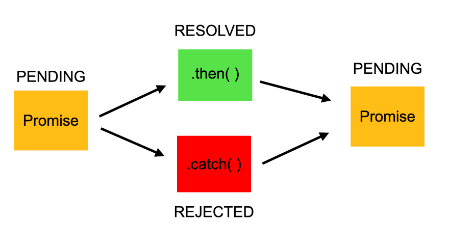

# 동기와 비동기

- 동기(Synchronous): 특정 코드를 수행 완료한 후 다음 코드를 실행
- 비동기(Asynchronous): 특정 코드를 수행하는 도중 다음 코드를 실행 <br/><br/><br/>

# 콜백(Callback)

## 콜백이란?

**다른 함수가 실행을 끝낸 뒤 실행(call back)되는 함수(** ⇒ 나중에 호출되는 함수)를 말한다. 파라미터로 함수를 전달받아, 함수 내부에서 실행된다.<br/><br/>

## 콜백함수(Callback Function) 사용 이유

- JavaScript에서 비동기적 프로그래밍을 할 수 있기 때문
- JavaScript는 싱글스레드를 사용하는데, 멈춤을 방지해준다. 즉, **블로킹을 방지하여 싱글스레드가 논블로킹으로 동작하게 한다.**<br/><br/>

## 콜백함수 사용 유형

1. **익명 함수 사용**

   - 함수의 내부에서 실행되기 때문에 이름을 붙이지 않아도 된다.

   ```jsx
   setTimeout(function () {
     console.log('1초 후에 실행됩니다.');
   }, 1000);
   ```

2. **함수의 이름(만) 넘기기**

   - JavaScript는 null과 undefined 타입을 제외하고 모든 것을 객체로 다룬다. 함수를 변수 또는 다른 함수의 변수처럼 사용할 수 있다. 함수를 콜백함수로 사용할 경우, 함수의 이름만 넘겨주면 된다.

   ```javascript
   function callbackFunction() {
     console.log('콜백 함수가 실행되었습니다.');
   }

   setTimeout(callbackFunction, 1000);
   ```

3. **전역변수, 지역변수를 콜백함수의 파라미터로 전달 가능**

   - 전역변수: 함수 외부에서 선언된 변수
   - 지역변수: 함수 내부에서 선언된 변수

   ```jsx
   let globalVariable = '전역변수';

   function outerFunction(callback) {
     let localVariable = '지역변수';
     callback(globalVariable, localVariable);
   }

   outerFunction(function (glob, loc) {
     console.log(glob); // "전역변수"
     console.log(loc); // "지역변수"
   });
   ```

<br/><br/><br/>

# 콜백함수 주의할 점

## this를 사용한 콜백함수

JavaScript에서 `this`는 실행 컨텍스트에 따라 그 값이 다르게 바인딩된다. 콜백 함수는 어디에서 어떻게 호출되는지에 따라 `this`의 값이 예상과 다르게 바인딩될 수 있기 때문에 주의가 필요하다.

```javascript
const obj = {
  name: 'Object',
  registerCallback: function () {
    setTimeout(function () {
      console.log(this.name);
    }, 1000);
  },
};

obj.registerCallback(); // undefined 또는 전역 객체의 name 속성값 (기본적으로 window나 global)
```

<br/><br/>

## 콜백 지옥(Callback Hell)


- 여러 비동기 작업을 순차적으로 수행해야 할 경우, 콜백 내부에 다른 콜백을 중첩하여 사용하게 되는데, 이러한 중첩이 깊어지면 코드의 가독성이 떨어지는 콜백 지옥에 빠질 수 있다.
- Promise, async/await, Generator 등을 사용하여 방지할 수 있다<br/><br/><br/>

# Promise

## Promise란?

프로미스는 자바스크립트 **비동기 처리에 사용되는 객체**이다. 싱글 스레드인 자바스크립트에서 비동기 처리를 위해 사용한 **콜백 함수의 에러/예외처리의 어려움, 중첩으로 인한 복잡도 증가라는 단점을 해결**하기 위해 ES6에서 언어적 차원으로 지원한다.<br/><br/>

## Promise 구조

```javascript
const promise = new Promise((resolve, reject) => {
  /*
		Promise 성공시 resolve() 호출하고,
		Promise 실패시 reject()를 호출한다.
	*/
});

promise
  .then
  // resolve가 호출되면 then이 실행
  ()
  .catch
  // reject가 호출되면 catch가 실행
  ()
  .finally
  // 콜백 작업을 마치고 무조건 실행되는 finally(생략 가능)
  ();
```

- Promise 성공 시 resolve를 호출하고 실패 시 reject를 호출한다.
- Promise 다음엔 then()과 catch()를 사용한다
- then()은 생성한 프로미스 객체에서 인수로 전달한 resolve가 호출되면 실행한다.
- catch()는 생성한 프로미스 객체에서 인수로 전달한 reject가 호출되면 실행한다.

### 예시

```javascript
const flag = true;
const promise = new Promise((resolve, reject) => {
  if (flag) {
    resolve('resolve');
  } else {
    reject('reject가 되었음');
  }
});

promise
  .then((resolveMessage) => {
    console.log(resolveMessage);
  })
  .catch((errorMessage) => {
    console.log(errorMessage);
  });
```

<br/><br/>

## Promise 상태



- ⭐ **pending**(대기): 비동기 처리 로직이 아직 완료되지 않은 상태
- ⭐ **fulfilled**(이행): 비동기 처리가 완료 되어 프로미스가 결과 값을 반환해준 상태
- ⭐ **redjected**(실패): 비동기 처리가 실패하거나 오류가 발생한 상태
- settled(완료): fulfilled와 rejected를 합쳐 부르는 완료 상태

# async/await

## async/await란?

비동기식 코드를 동기식으로 표현하여 간결하게 나타낼 수 있는 ES7의 기능이다. 내부적으로 Promise 객체를 반환한다.

```javascript
async function myAsync() {
  return 'async';
}

myAsync().then((result) => {
  console.log(result); // async
});
```

<br/><br/>

## async/await 구조

```javascript
async function 함수명() {
  try {
    await 비동기_처리_메서드_명();
  } catch (error) {
    /* 예외처리 */
  }
}
```

- 함수 앞에 async라는 예약어를붙인다.
- 비동기 처리 코드 앞에 await를 붙인다.
  - 비동기 처리 메서드가 꼭 프로미스 객체를 반환해야 await가 의도한대로 동작한다.
- try…catch…구문으로 예외처리를 한다.<br/><br/><br/>

# callback vs promise vs async/await

## callback

```javascript
function increaseNumberWithCallback(num, callback, errorCallback) {
  setTimeout(() => {
    if (typeof num === 'number') {
      callback(num + 1);
    } else {
      errorCallback(new Error('Expect a number'));
    }
  }, 1000);
}

increaseNumberWithCallback(
  0,
  (num1) => {
    console.log(num1); // 1
    increaseNumberWithCallback(
      num1,
      (num2) => {
        console.log(num2); // 2
        increaseNumberWithCallback(
          num2,
          (num3) => {
            console.log(num3); // 3
          },
          (error) => {
            console.error(error);
          },
        );
      },
      (error) => {
        console.error(error);
      },
    );
  },
  (error) => {
    console.error(error);
  },
);
```

## promise

```javascript
function increaseNumberWithPromise(num) {
  return new Promise((resolve, reject) => {
    setTimeout(() => {
      if (typeof num === 'number') {
        resolve(num + 1);
      } else {
        reject(new Error('Expect a number'));
      }
    }, 1000);
  });
}

increaseNumberWithPromise(0)
  .then((num1) => {
    console.log(num1); // 1
    return increaseNumberWithPromise(num1);
  })
  .then((num2) => {
    console.log(num2); // 2
    return increaseNumberWithPromise(num2);
  })
  .then((num3) => {
    console.log(num3); // 3
  })
  .catch((error) => {
    console.error(error);
  });
```

### Promise Chaining

여러개의 Promise를 연결하여 순차적으로 실행하게 해준다. 각각의 `then`은 작업이 완료된 후의 값을 반환하거나 새로운 프로미스를 반환하여 다음 `then`으로 연결될 수 있다.

## async/await

```javascript
function increaseNumber(num) {
  return new Promise((resolve, reject) => {
    setTimeout(() => {
      if (typeof num === 'number') {
        resolve(num + 1);
      } else {
        reject(new Error('Expect a number'));
      }
    }, 1000);
  });
}

async function increaseNumberAsync() {
  try {
    let num1 = await increaseNumber(0);
    console.log(num1); // 1

    let num2 = await increaseNumber(num1);
    console.log(num2); // 2

    let num3 = await increaseNumber(num2);
    console.log(num3); // 3
  } catch (error) {
    console.error(error);
  }
}

increaseNumberAsync();
```
