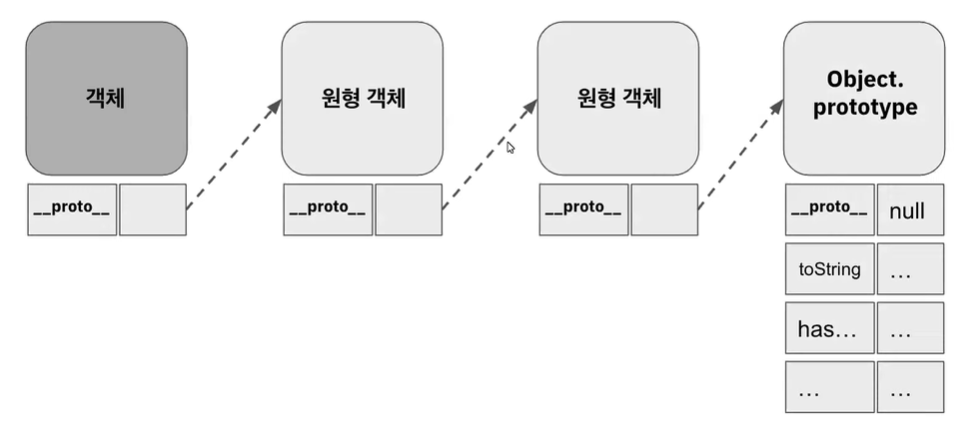

# 프로토타입 객체

JavaScript는 클래스 기반 객체지향 프로그래밍 언어와 달리 **기존의 객체를 복제하여 새로운 객체를 생성**한다. 이를 프로토타입 기반 객체지향 프로그래밍 언어라 한다.

여기서 복제라는 말은 **프로토타입 링크를 통해 해당 객체를 참조하여 만드는 것**을 말한다.<br/><br/><br/>

# 프로토타입 링크

원시타입(Number, String, Boolean, Symbol, Undefined, Null)을 제외한 모든 참조타입은 다 객체이다. 그래서 배열이나 함수도 자바스크립트에서는 모두 객체라고 말하고 있다. **자바스크립트 객체가 원형을 참조해서 새로운 객체를 만들게 되는데 이 때 프로토타입 링크(`__proto__`)가 만들어진다.**

이 객체는 프로토타입 링크를 가지기 때문 다른 원형을 참조해서 만들어지게 된다. 링크를 타고 타고 가면 자바스크립트이 최종 원형 객체인 Object.prototype이란 것에 도달하게 된다.

<br/><br/>

## 예시

프로토타입 링크는 객체의 `__proto__`속성을 통해 접근할 수 있다.

```jsx
function Animal(name) {
  this.name = name;
}

Animal.prototype.speak = function () {
  console.log(this.name + ' makes a noise.');
};

let animal = new Animal('Animal');

console.log(animal.__proto__ === Animal.prototype); // true
```

<br/><br/><br/>

# 프로토타입 체인

일련의 연속적으로 이루어지는 프로토타입 링크를 프로토타입 체인이라고 말한다.

bar란 객체 속성된 것만 탐색을 하는 게 아니라 Object.prototype이라는 자바스크립트의 최종 원형 객체까지 탐색을 한 후 해당 값을 반환한다.<br/><br/>

## 예시

```jsx
// 1. Animal 생성자 함수 생성
function Animal(name) {
  this.name = name;
}

// 2. 프로토타입에 speak 메소드 추가
Animal.prototype.speak = function () {
  console.log(this.name + ' makes a noise.');
};

// 3. Cat, Dog 생성자 함수 정의: call 메소드를 이용하여 Animal 속성 상속
function Cat(name) {
  Animal.call(this, name);
}

function Dog(name) {
  Animal.call(this, name);
}

// 4. Animal.prototype 상속 받도록 설정
Cat.prototype = Object.create(Animal.prototype);

Dog.prototype = Object.create(Animal.prototype);

// 5. Dog 생성자 함수에 speak 메소드 오버라이딩
Dog.prototype.speak = function () {
  console.log(this.name + ' barks.');
};

let cat = new Cat('Chaenny');
cat.speak(); // Chaenny makes a noise.

let dog = new Dog('Gunny');
dog.speak(); // Gunny barks.
```

`Cat` 인스턴스가 `speak` 메소드를 호출하면 `Cat.prototype`에는 `speak` 메소드가 없으므로 **프로토타입 체인을 통해 `Animal.prototype.speak` 메소드가 호출된다.**

반면에, `Dog` 인스턴스는 `Dog` 생성자 함수에서 `speak` 메소드를 오버라이드하였기 때문에 `speak`를 호출할 때 `Animal.prototype.speak` 메소드를 사용하지 않고 `Dog.prototype.speak` 메소드를 사용하게 된다.

이런 방식으로, 프로토타입 체인은 상속과 메소드 공유를 가능하게 하며, 메소드 오버라이딩은 특정 인스턴스에서의 메소드의 동작을 변경할 수 있다.<br/><br/><br/>

# this 메소드 추가 vs 프로토타입 메소드 추가

this를 통한 메소드 추가, 프로토타입을 통한 메소드 추가, 뭐가 다른 걸까? 생성자 함수의 **`this`**를 사용하여 메소드를 추가하는 방법과 프로토타입에 메소드를 추가하는 방법은 사실상 동일한 기능을 수행하지만, **메모리 사용과 관련하여 차이가 있다.**

## 생성자 함수의 this를 사용하여 메소드 추가

이 방법은 **각 객체마다 독립적인 메소드를 생성**한다. 따라서 같은 기능을 가진 메소드를 각각의 객체마다 따로 가지게 되어 메모리를 더 많이 사용하게 된다.

```jsx
function Person(name) {
    this.name = name;
    this.sayHello = function() {
        return this.name + " says hello!";
    }
}

let person1 = new Person("Chaeeun");
let person2 = new Person("Taehwan");

**console.log(person1.sayHello === person2.sayHello); // false**
```

위의 코드에서 **`person1`**과 **`person2`**는 각각 자신만의 **`sayHello`** 메소드를 가지고 있다. 이들 메소드는 기능적으로 동일하지만, 실제로는 서로 다른 메모리 주소에 할당된 별개의 함수이다.<br/><br/>

## 프로토타입에 메소드 추가

모든 인스턴스가 하나의 메소드를 공유하게 만든다. 이는 메모리 효율성을 향상시키는 방법이며, 모든 인스턴스가 동일한 동작을 공유하게 된다.

```jsx
function Person(name) {
    this.name = name;
}

Person.prototype.sayHello = function() {
    return this.name + " says hello!";
}

let person1 = new Person("Chaeeun");
let person2 = new Person("Taehwan");

**console.log(person1.sayHello === person2.sayHello); // true**
```

위의 코드에서 **`person1`**과 **`person2`**는 동일한 **`sayHello`** 메소드를 공유한다. 이 메소드는 **`Person.prototype`**에 저장되어 있으며, 모든 **`Person`** 인스턴스에서 접근할 수 있다.<br/><br/>

# 정리

1. 자바스크립트는 프로토타입 기반 객체 지향 프로그래밍 언어이다.
2. 프로토타입 기반 언어인 자바스크립트의 객체는 원형으로부터 생성된다
3. 생성된 객체는 프로토타입 링크(`__proto__`)를 통해 원형을 참조한다.
4. 객체들 사이에 형성된 프로토타입 링크를 프로토타입 체인이라고 한다.

# 참고

[https://www.youtube.com/watch?v=7UmApWKRGRw&t=321s](https://www.youtube.com/watch?v=7UmApWKRGRw&t=321s)
