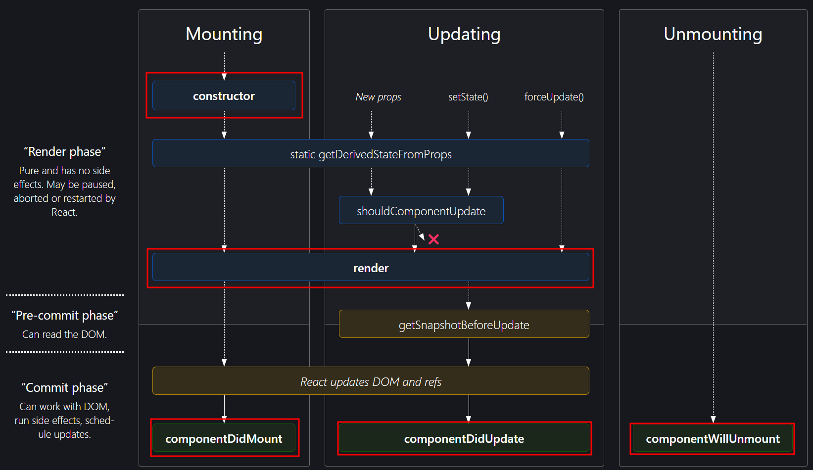
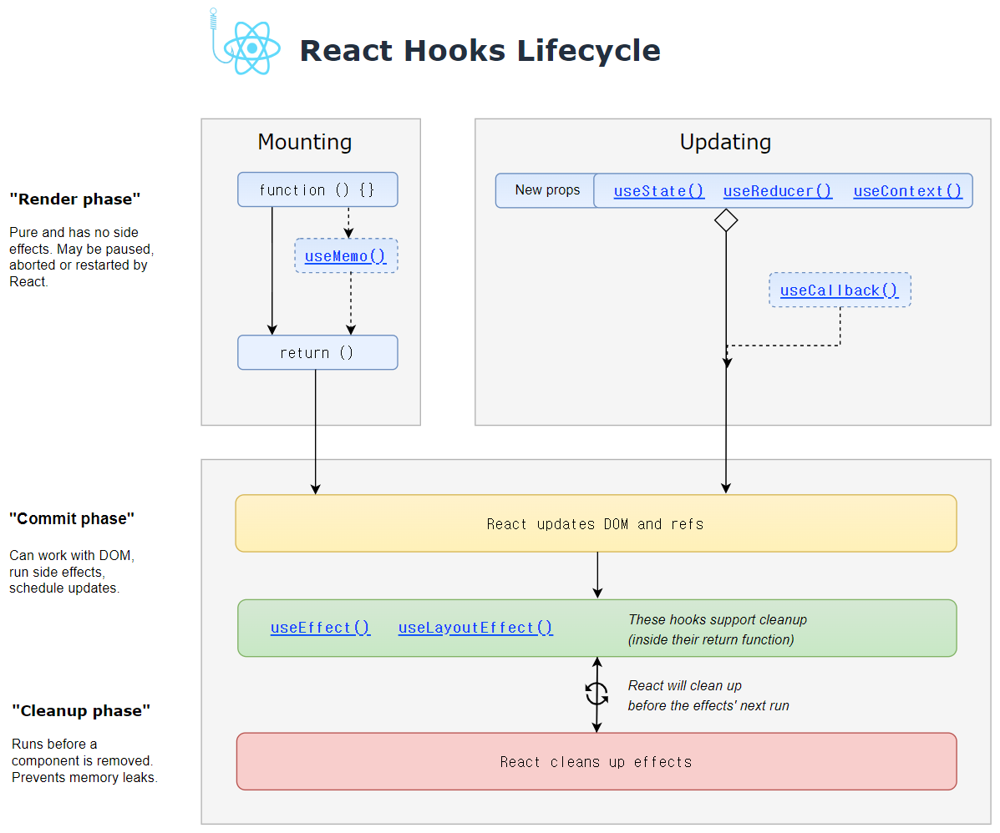

# 생명주기란?

컴포넌트가 생성(마운트), 수정(업데이트), 제거(언마운트) 될 때 발생하는 특정 이벤트들의 흐름이다. 리액트 클래스 컴포넌트는 라이프 사이클 메서드를 사용하고, 함수형 컴포넌트는 Hook을 사용한다.  

## 상태(state)

리액트에서는 각 컴포넌트에서 제어하는 데이터를 상태(State)라고 한다. 상태는 컴포넌트 내에서 변경될 수 있으며, 변경 시 해당 컴포넌트는 다시 렌더링된다.  

# 클래스 컴포넌트 생명주기

클래스 컴포넌트의 생명주기는 세 가지 단계로 나눈다.

1. **초기화** 단계(Mounting): 컴포넌트가 브라우저에 나타날 때
2. **업데이트** 단계(Updating): 컴포넌트의 props나 state가 바뀌었을 때
3. **소멸** 단계(Unmounting): 컴포넌트가 브라우저상에 사라질 때

## **마운트(mount):** 컴포넌트가 생성 되는 시점

⭐[**constructor**](https://legacy.reactjs.org/docs/react-component.html#constructor)(생성자): 컴포넌트가 생성될 때 가장 먼저 호출되는 메서드로, 초기 상태와 메서드를 설정한다.

[getDerivedStateFromProps](https://legacy.reactjs.org/docs/react-component.html#static-getderivedstatefromprops): props로부터 파생된 state를 가져온다. 즉 props로 받아온 것을 기반으로 state를 업데이트 한다.(매우 드문 상황에만 사용한다.)

⭐[**render**](https://legacy.reactjs.org/docs/react-component.html#render) :컴포넌트의 UI를 렌더링하는 메서드이다. JSX를 반환한다.

⭐[**componentDidMount**](https://legacy.reactjs.org/docs/react-component.html#componentdidmount): 컴포넌트가 화면에 나타난 후 호출되는 메서드로, 외부 데이터를 가져오거나 DOM 작업을 수행하는 등의 초기화 작업을 수행한다.   

## 업데이트(update): 컴포넌트가 업데이트되는 시점

[getDerivedStateFromProps](https://legacy.reactjs.org/docs/react-component.html#static-getderivedstatefromprops): props 또는 state가 변경되었을 때 호출된다.

[shouldComponentUpdate](https://legacy.reactjs.org/docs/react-component.html#shouldcomponentupdate): 컴포넌트의 업데이트를 결정하기 위해 호출되는 메서드로, 반환 값에 따라 업데이트 여부가 결정된다. 성능 최적화를 위해 사용되며, 잘못 사용할 경우 불필요한 렌더링을 유발할 수 있다.

[**render**](https://legacy.reactjs.org/docs/react-component.html#render): 컴포넌트의 UI를 렌더링하는 메서드이다. JSX를 반환한다.

[getSnapshotBeforeUpdate](https://legacy.reactjs.org/docs/react-component.html#getsnapshotbeforeupdate): 업데이트 이전과 이후의 상태를 비교하여 추가 작업을 수행한다.

⭐[**componentDidUpdate**](https://legacy.reactjs.org/docs/react-component.html#componentdidupdate): 컴포넌트가 업데이트된 후 호출된다.함수형 컴포넌트에서는 Hook을 사용하여 생명주기를 관리합니다. 대표적으로 **`useEffect`** Hook이 있습니다.  

## 언마운트(unmount): 컴포넌트가 화면에서 사라지는 시점

⭐[**componentWillUnmount**](https://legacy.reactjs.org/docs/react-component.html#componentwillunmount): 컴포넌트가 화면에서 사라지기 직전에 호출되는 메서드이다. 리소스 해제나 이벤트 리스너 제거 등의 정리 작업을 수행한다.  

# 함수형 컴포넌트 생명주기

함수형 컴포넌트에서는 Hook을 사용하여 생명주기를 관리합니다. 대표적으로 **`useEffect`** Hook이 있습니다.  

## **useEffect Hook**

**`useEffect`** 는 클래스 컴포넌트의 여러 생명주기 메서드를 결합한 것과 비슷하며, 마운팅, 업데이팅, 언마운팅 시점에 코드를 실행할 수 있다.

- **`useEffect(() => {})`**: 렌더링 결과가 실제 DOM에 반영된 후마다 호출된다.
- **`useEffect(() => {}, [])`**: 컴포넌트가 처음 나타날 때 한 번만 호출된다. (마운팅)
- **`useEffect(() => {}, [dependency1, dependency2, ...])`**: 의존성 배열 내의 값 중 하나가 변경되면 effect가 재실행된다. (업데이트)
- **`useEffect(() => { return () => { // 정리 로직 }; }, []);`**: 컴포넌트가 언마운트 될 때 정리 작업을 수행한다.  

# 함수형 컴포넌트와 클래스형 컴포넌트 비교

| 분류       | 클래스형 컴포넌트      | 함수형 컴포넌트                  |
| ---------- | ---------------------- | -------------------------------- |
| Mounting   | constructor()          | 함수형 컴포넌트 내부             |
| Mounting   | render()               | return()                         |
| Mounting   | ComponenDidMount()     | useEffect() (빈 의존성 배열)     |
| Updating   | componentDidUpdate()   | useEffect() (의존성 배열에 따라) |
| UnMounting | componentWillUnmount() | useEffect() (정리 함수를 반환)   |

- 나머지 컴포넌트 생명 주기관련 메서드는 useEffect와 다른 Hooks를 적절히 활용하여 비슷한 기능을 구현할 수 있다.   

# 참고

[https://projects.wojtekmaj.pl/react-lifecycle-methods-diagram/](https://projects.wojtekmaj.pl/react-lifecycle-methods-diagram/)

[https://velog.io/@kimmiri235/lifecycle](https://velog.io/@kimmiri235/lifecycle)

[https://velog.io/@minbr0ther/React.js-리액트-라이프사이클life-cycle-순서-역할](https://velog.io/@minbr0ther/React.js-%EB%A6%AC%EC%95%A1%ED%8A%B8-%EB%9D%BC%EC%9D%B4%ED%94%84%EC%82%AC%EC%9D%B4%ED%81%B4life-cycle-%EC%88%9C%EC%84%9C-%EC%97%AD%ED%95%A0)

[https://wavez.github.io/react-hooks-lifecycle/](https://wavez.github.io/react-hooks-lifecycle/)

[https://velog.io/@ahsy92/기술면접-React의-라이프-사이클-09q2s7uw](https://velog.io/@ahsy92/%EA%B8%B0%EC%88%A0%EB%A9%B4%EC%A0%91-React%EC%9D%98-%EB%9D%BC%EC%9D%B4%ED%94%84-%EC%82%AC%EC%9D%B4%ED%81%B4-09q2s7uw)
