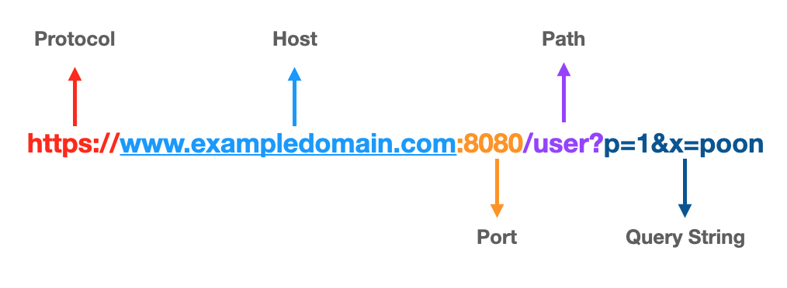
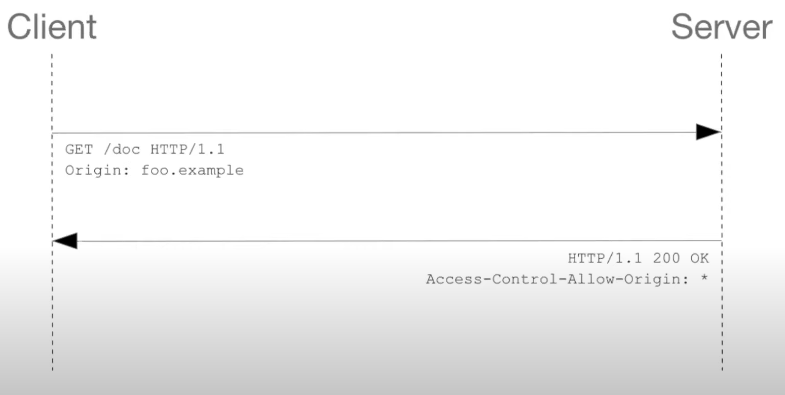
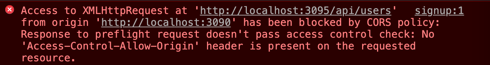

# **CORS**

## **출처란?**



URL의 `Protocol`, `Host`, `Port`를 통해 같은 출처인지 다른 출처인지 판단할 수 있습니다.

셋 중 하나라도 문자열이 다르면 다른 출처라고 판단합니다!

## **SOP**

다른 출처의 리소스 사용하는 것을 제안하는 보안 방식

왜 SOP가 필요할까?

1. 사용자는 A서비스 로그인한 후에 사용합니다. (사용자는 A서비스로부터 인증 토큰을 받아옵니다)
2. 해커가 사용자에게  악성메일을 보내고
3. 사용자가 만약 링크를 클릭할 시 [http://hacker.ck](http://hacker.ck) 로 이동하게 되고 해커가 심어놓은 스크립트가 1번에서 받아온 인증 토큰을 사용해 실행됩니다.
4. 이 때 SOP를 통해 이 요청이 어디서 왔는지 확인합니다. 
5. 악성 스크립트는 [http://hacker.ck](http://hacker.ck)라는 출처에서 왔기 때문에  SOP에 위반되어 받아들여지지 않습니다.

그렇다면 다른 출처의 자원을 써야하는 경우에는 어떻게해야하지?

→ 그래서 등장한 것이 CORS 입니다.

## **CORS**

교차 출처 리소스 공유(Cross-Origin Resource Sharing, CORS)는 추가 HTTP 헤더를 사용하여, **한 출처**에서 실행 중인 웹 애플리케이션이 **다른 출처**의 선택한 **자원**에 **접근할 수 있도록** 권한을 부여하도록 **브라우저에 알려주는 체제**입니다.

## **CORS 접근제어 시나리오**

**CORS 접근제어 시나리오는 3가지의 종류가 있습니다!**

1. **단순 요청 (Simple Request)**
    
    Preflight 요청 없이 바로 요청을 날리는 것입니다. 하지만 조건이 있습니다.
    
    - GET, POST, HEAD 메서드
    - Content-Type이 아래와 같아야합니다. 
    application/x-www-form-urlencoded
    multipart/form-data
    text/plain
    - 헤더는 Accept,  Accept-Language, Content-Language, Content-Type 만 허용됩니다.
    
         
    

2. **프리플라이트 요청(Preflight Request)**
    
    → 본 요청을 보내기 전 서버에 확인하는 작업
    
    1.  OPTIONS 메서드를 통해 다른 도메인의 리소스에 요청이 가능한 지 확인 작업
    2. 요청이 가능하다면 실제 요청을 보낸다.
        
        
        
        
        
    
    ### **Preflight가 왜 필요할까?**
    
    
    
    만약 Preflight가 없을 때 우리가 요청을 Browser에 보내면 브라우저는 그대로 서버에 보냅니다!  
    
    그러면 **Server는 CORS에 관련해 모르기 때문에 요청을 실행한 뒤** `ALLOW-ORIGIN : 없음`이라는 응답을 하고 브라우저는 CORS오류를 Client에 넘깁니다.
    
    만약 처음 요청이 DB에 모든 데이터를 삭제하는 것이다? 
    그렇다면 우리의 DB 데이터를 모두 삭제한 뒤에 CORS 오류가 발생할 것입니다.
    
    따라서 CORS를 모르는 서버를 위해 Preflight를 통한 사전 확인 작업이 필요한 것입니다!
    
    
    
3. **인증정보 포함 요청(Credentialed Request)**
    
    인증 관련 헤더를 포함할 때 사용하는 요청입니다.
    
    cookie, jwt 토큰을 클라이언트에서 자동으로 담아서 보내고 싶을 때
    클라이언트 측에서 `credentials : include`를 하고
    
    서버측은  `Access-Control-Allow-Credentials : true`을 해줘야한다!
    (이 때 Access-Control-Allow-Origin : * 은 할 수 없다!)
    

## **CORS 해결법**

1. **프론트 프록시 서버 설정해주기**
    
    
    
    이런 오류가 떴을 때 
    
    ```jsx
    // webpack.config.ts
    const config: webpack.Configuration = {
      ...
      devServer: {
        proxy: {
          '/api/': { // /api/로 시작하는 url은 아래의 전체 도메인을 추가하고, 옵션을 적용 
            target: 'http://localhost:3095', // 클라이언트에서 api로 보내는 요청은 주소를 3095로 바꿔서 보내겠다 라는 뜻
            changeOrigin: true, // cross origin 허용 설정
          },
    			'/auth':{
    				target: 'http://localhost:3095', // 클라이언트에서 auth로 보내는 요청은 주소를 3095로 바꿔서 보내겠다 라는 뜻
            changeOrigin: true, // cross origin 허용 설정
        },
      },
      ...
    }
    ```
    
    프록시를 설정해주고
    
    ```jsx
    // proxy 적용 전 비동기 요청 코드
    axios
      .post('http://localhost:3095/api/users', {
        email,
        nickname,
        password,
      })
    기 요청 코드
    axios
      .post('http://localhost:3095/auth/login', {
        email,
        password,
      })
    
    // proxy 적용 후 비동기 요청 코드
    axios
      .post('/api/users', {
        email,
        nickname,
        password,
      })
    
    axios
      .post('/auth/login', {
        email,
        password,
      })
    
    ```
    
    비동기 주소를 다음과 같이 바꿔주면 CORS 에러가 해결됩니다! 
    
    **서버에서 서버로 요청을 하게될 때에는 브라우저의 규약인 CORS 정책에 영향을 받지 않는다는 점을 이용해** CORS 정책을 위반하지 않게되어 우회 할 수 있게 된다.
    
    [https://velog.io/@zero-black/CORS-에러-해결하기-Reverse-Proxy-server-구축-with-Nginx](https://velog.io/@zero-black/CORS-%EC%97%90%EB%9F%AC-%ED%95%B4%EA%B2%B0%ED%95%98%EA%B8%B0-Reverse-Proxy-server-%EA%B5%AC%EC%B6%95-with-Nginx)
    
    [https://gobae.tistory.com/109](https://gobae.tistory.com/109)
    
2. **직접 헤더에 설정해주기**
    
    매번 바꾸기엔 힘들겠죠?!
    

출처 : <br/>
[https://www.youtube.com/watch?v=-2TgkKYmJt4](https://www.youtube.com/watch?v=-2TgkKYmJt4)
[https://velog.io/@jjhstoday/webpack-proxy를-사용하여-CORS-에러-해결-하기](https://velog.io/@jjhstoday/webpack-proxy%EB%A5%BC-%EC%82%AC%EC%9A%A9%ED%95%98%EC%97%AC-CORS-%EC%97%90%EB%9F%AC-%ED%95%B4%EA%B2%B0-%ED%95%98%EA%B8%B0)