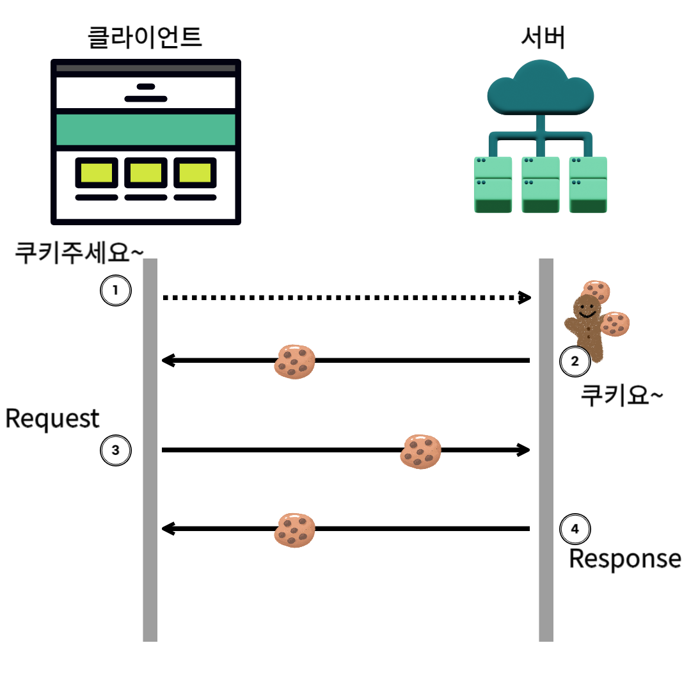
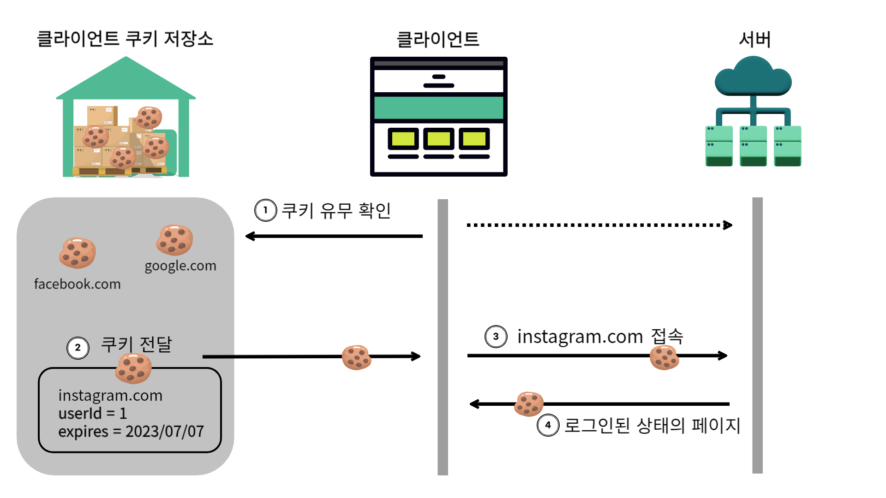
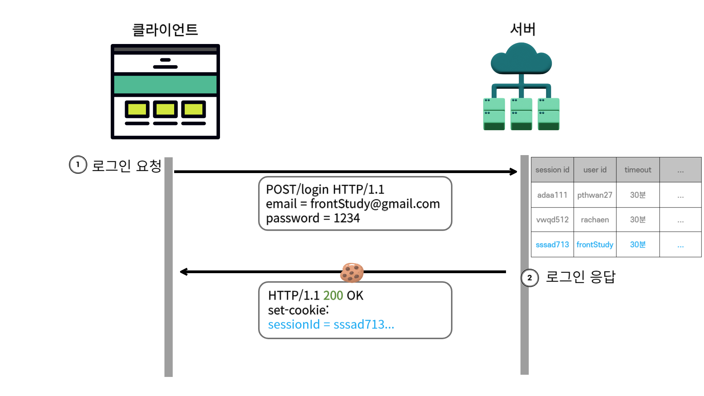
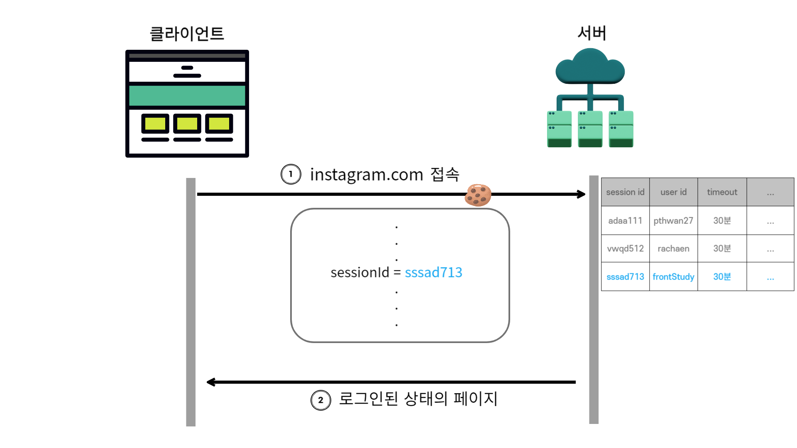

# 쿠키(Cookie)

**클라이언트에 저장되는 key-value 형태의 작은 데이터 파일**로 주로 사이트 방문 이력, 검색 기록, 로그인 상태 등을 저장한다.  

## 쿠키의 특징

- **브라우저 단위**로 쿠키를 생성
  - safari, chrome 등 각각 다른 쿠키가 발행된다.
- 다른 도메인을 대신하여 쿠키 발급 불가

    

  - 예를들면 페이스북은 인스타그램의 쿠키를 대신해서 발행할 수 없다.

- 만료 시간까지 상태 정보 유지  

## 쿠키 사용 이유

**웹 사이트 재방문 시 효율적으로 서비스를 제공**하기 위해서이다. 상태를 유지할 수 없는 http protocol의 특성상 사용자 맞춤형 서비스를 제공할 수 없기 때문에 쿠키를 이용하여 상태를 저장한다.  

## 동작방식

1. 클라이언트가 서버측에 요청을 보낸다.
2. 요청을 받은 서버는 브라우저에게 정보를 받은 다음에 브라우저에 대한 정보를 쿠키안에 넣는다. 그 후 클라이언트에게 응답과 함께 쿠키를 보낸다.
3. 응답을 받은 클라이언트는 요청을 할 때마다 쿠키를 HTTP 헤더에 담아 서버에 Request를 보낸다.
4. 만약 쿠키에 업데이트 사항이 필요하다 판단이 되면 서버는 쿠키를 바꿔서 클라이언트에게 응답으로 보내준다.  

## 쿠키 이용 예시

- 장바구니
  - 로그인하지 않은 상태로 장바구니에 넣었는데 브라우저를 닫은 후 다시 접속해도 장바구니에 담겨있는 상황
- 오늘 이 창을 다시 보지 않기
- **로그인 유지**  

## 예시) only 쿠키 로그인 동작방식

### 첫 로그인

1. 클라이언트는 instagram.com에 로그인을 하기 위해서 email과 password를 요청으로 보낸다.
2. instagram.com은 email과 password를 보고 DB에서 어떤 유저인지 확인을 하고 userId를 찾는다. 서버는 유저의 id가 1이라는 것을 쿠키에 넣어보낸다. + 추가적으로 만료기간도 같이 보낸다.
3. 클라이언트측은 쿠키를 받는다.
4. 브라우저의 쿠키 저장소안에 쿠키를 저장한다.  

### 로그인 유지

1. instagram.com에 접속하기 전에 브라우저의 쿠키 저장소에 해당 도메인의 쿠키가 있는지 확인한다
2. 쿠키를 브라우저에 전달
3. 쿠키를 가지고 instagram.com에 접속시도
4. instagram.com 서버는 쿠키에 있는 사용자 정보인 userId를 보고 클라이언트에게 유저가 로그인된 상태의 페이지를 보여준다.  

## 쿠키 문제점: 쿠키 탈취

쿠키가 탈취 당하면 어떻게될까?

1. 쿠키 값을 임의로 바꿀 수 있다.
2. 대신 로그인할 수 있다.
3. 쿠키에 중요 정보가 들어있을 경우엔 큰일이다

해결방법 => **쿠키와 세션을 같이 사용**한다!  

# 세션(Session)

**웹 사이트에 이용되는 사용자 정보를 서버에 저장하는 방법**  

## 예시) 쿠키 & 세션 로그인 동작방식

쿠키에서 동작방식을 자세하게 설명했으므로 간단하게 표현하겠다!  

### 첫 로그인

1. 클라이언트는 instagram.com에 로그인을 하기 위해서 email과 password를 요청으로 보낸다.
2. 서버의 sessionDB는 userId와 sessionId가 매칭되어있다. 클라이언트 요청으로 받아진 email과 password를 확인 후 검증되었다면 userId를 sessionDB에서 검색한다. 검색이 된 sessionId를 반환하여 쿠키에 담아 보낸다.
3. 클라이언트 측은 쿠키를 받아 쿠키 저장소에 저장한다.  

### 로그인 유지

1. 해당 도메인의 쿠키를 서버에 보내 instagram.com에 접속을 시도한다.
2. 서버는 session ID를 보고 만료되지 않았다면 session ID에 매칭되는 유저가 frontStudy임을 확인하고 로그인된 상태의 페이지를 클라이언트에게 보여준다.

## 세션을 서버에 두는 이유

쿠키에는 세션 ID만 저장하고, 이 ID를 사용해 서버 측에서 사용자 데이터를 찾음으로써 사용자 정보가 클라이언트에 노출되지 않음으로써 보안성을 확보한다.   

## 세션 단점

1. 유저 정보가 서버에 있기 때문에 **처리 속도에 대한 비용** 발생
2. 서버 자원을 사용하기 때문에 유저가 많아지면 **저장 공간에 대한 비용** 발생

⇒ 서버 리소스와 처리 시간이 많이 필요하므로, 비용 문제를 해결하기 위해 토큰 기반 인증(예: JWT)을 사용할 수 있다.   

# 정리

쿠키

- **사용자 브라우저에 저장**됨
- **key, value로 구성**
- 통신 시 **HTTP 헤더**에 포함하여 서버에 전송됨
- key, value, 유효시간, 도메인(쿠키를 전송할 도메인), 경로정보(쿠키를 전송할 요청 경로) 포함
- 사용자 브라우저에 저장된 값을 확인하기 때문에 **보안성이 낮음**

세션

- **서버에서 관리**
- 클라이언트에 **세션ID 부여**, 브라우저 종료할 때까지 인증상태 유지됨
- 서버에 저장되므로 데이터 탈취가 어려움, **보안성이 비교적 높음**
- 동접자수가 많은 경우 **서버에 과부하**를 주어 성능저하 원인이 됨

# 참고

https://www.youtube.com/watch?v=XgcCkcKGbys&t=93s
https://suyeoniii.tistory.com/82
